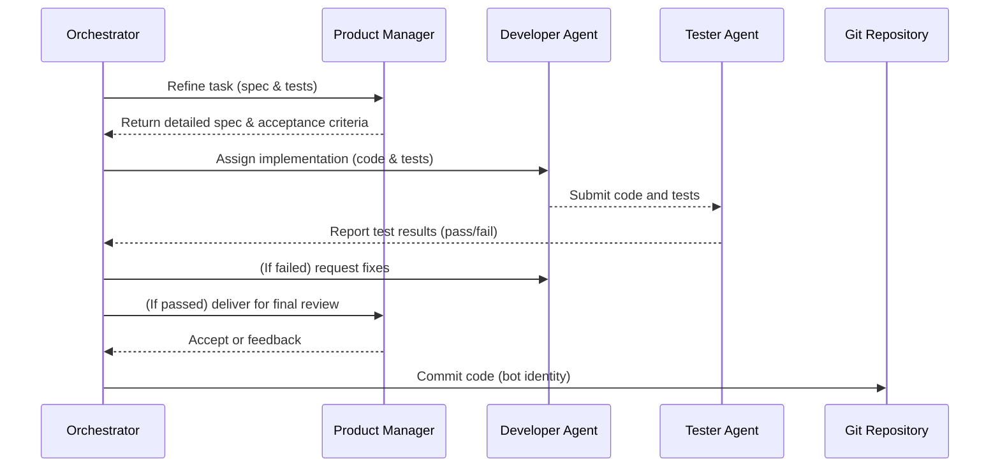
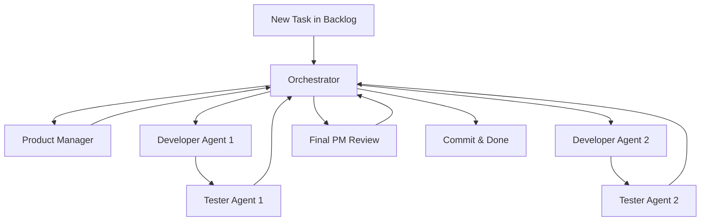

# Multi-Agent AI Development Workflow

**Executive Summary:** This document defines a generic AI agent orchestration workflow for software development. A *planning agent* (orchestrator) manages a backlog of tasks and delegates to *worker agents* with specialized roles (e.g. developers, testers, reviewers).  Each worker handles coding, testing, or review in parallel. The orchestrator assigns tasks, gathers results, and commits code using a designated service identity. Policies cover authentication (dedicated bot accounts, SSH keys), Git configuration (setting author/committer via environment or CLI), commit signing (GPG/SSH), and auditability (separate audit trail for bot commits).  Agents communicate via shared state (issues, files, or message bus), with conflict resolution via reviews and test-feedback loops.  The workflow is illustrated with tables and mermaid diagrams. Pseudocode examples show orchestration logic, and snippets cover Git commands, test automation, review bots, and CI integration. No specific programming language, framework, or OS is assumed (all examples are generic or in pseudocode).

## Agent Roles and Responsibilities

Agents are **specialized** with clear, narrow responsibilities. The orchestrator (planning agent) manages the process and delegates tasks. The table below summarizes typical roles:

| Agent Role           | Responsibilities                                | Specialty / Tools                          |
|----------------------|-------------------------------------------------|--------------------------------------------|
| **Orchestrator** (Planner)  | Manage backlog, assign tasks, enforce workflow, final commit gating | Workflow engine (e.g. central AI controller) |
| **Product Manager (PM)**    | Refine raw requests into detailed specs, acceptance criteria, user stories; final acceptance review | NLP for spec generation, domain knowledge |
| **Developer (Coder)**       | Write code and unit tests according to spec; fix bugs after testing | Coding LLM, IDE tools (GitHub Copilot, etc) |
| **Tester (QA)**             | Execute test suite (unit/integration) and verify acceptance criteria | Testing frameworks (pytest, JUnit, Playwright) |
| **Code Reviewer**           | Analyze diffs for style, security, logic issues; ensure code quality (multi-agent reviewers) | Linting tools, static analysis, LLM review agents |
| **Release/Merge Manager**   | Perform final merge/push if CI passes; tag releases | Git CLI, CI/CD tools |
| **On-Call / Observability** | Monitor CI/CD pipeline or production; respond to failures | Monitoring/alerting tools |
| **Security/Compliance**     | Enforce access controls, scan for secrets or license issues | Security scanners, policy engine |

Each worker agent acts autonomously but reports status back to the orchestrator. This division prevents one agent “writing and approving its own code”. By splitting tasks (e.g. separate style, logic, security reviewers) the system achieves **parallel validation** and auditability.

## Orchestration Patterns and Communication

The orchestrator coordinates agents following defined patterns. A **sequential** workflow might go step-by-step (e.g. PM → Dev → QA → PM acceptance), while a **concurrent** pattern runs multiple agents in parallel on independent subtasks. For example, multiple tasks (or code review subtasks) can be processed simultaneously to increase throughput. In a typical loop:



This sequence ensures each step is verified by a distinct agent (avoiding blind trust). Agents may exchange messages via a task queue, Git issues, or shared files. Parallel execution is common: e.g., two features are groomed and implemented concurrently, as long as their tasks don’t conflict. The orchestrator can handle multiple “promise” calls to agents (in e.g. Node.js or Python `asyncio.gather`) and then merge results.

Below is a simplified flowchart of this pipeline:



Each arrow represents task handoff. The orchestrator collects status (pass/fail) from QA agents. If any test fails, the orchestrator re-assigns fixes (loop back to Dev). Upon final acceptance by PM, the orchestrator commits the code. This pattern enforces *separation of duties* and adds redundancy (multi-review for code quality).

## Task Assignment, Conflict Resolution, and Synchronization

Tasks are typically created in a **backlog** (e.g. GitHub issues or a task file system). The orchestrator pulls the next task and assigns roles in order. For grooming and task breakdown, the PM agent leads. Then coding and testing can happen in parallel batches. If one agent detects a conflict (e.g. code merge conflict, or two agents modifying same file), the orchestrator must reconcile by re-fetching the latest state or by human intervention. Common strategies include:
- **Locking or queuing:** Ensure only one merge happens at a time on a given branch.
- **Rebasing:** Agents rebase or re-run if upstream changes occurred.
- **Iteration:** Agents iterate on feedback (tests, reviews); the orchestrator enforces a “return to coder if QA rejects” loop.
- **Consensus:** If multiple review agents disagree, the orchestrator may escalate to human review or choose based on confidence thresholds.

Shared state (task list, code repository) must be synchronized. Since agents only *commit* locally (never push), the orchestrator can perform an atomic push after merging all changes (see **Git Policies** below) to avoid mid-process conflicts.

## Git Configuration and Commit Policies

All commits created by AI agents must appear as commits from the repository owner's identity.

AI identities, bot identities, service accounts, or autogenerated author names are strictly prohibited.

The following values must always be used:

user.name=Shishir Lamichhane
user.email=shishirlamichhane718@gmail.com

- **Commit-Only, No Push:** Agents *only commit* to the local clone. Pushing is restricted to the orchestrator or CI system. This centralizes control: the orchestrator or a CI job can gather all local commits (from parallel agents) and push them together. It also prevents partial, unsynchronized pushes.

- **Branch Protections:** Use Git branch policies. For example, disallow direct pushes to `main`; require PR reviews by the orchestrator or human after agent commits. Mark the bot as a separate actor so policies (code owners, required reviews) can treat bot commits specially.

- **GPG/SSH Signing:** Enable commit signing for integrity. Configure `git config commit.gpgSign true` (or `-S`) to sign each commit. This ensures commits are not tampered with and are traceable to the bot identity.

- **Audit Trail:** With a unique author/email, one can filter logs (e.g. `git log --author=agent-bot`) to audit all automated changes. Disable email in commit messages or include tags like `[agent-bot]` to mark automated work.

By following Git’s documented mechanisms for authoring identity, we guarantee that all agent commits use the sanctioned identity. A sample `.agent/rules/git.md` might instruct agents accordingly. 

## Testing and Review Automation

Agents automatically generate and run tests. For example, after the developer agent writes code, it also writes unit tests (or the QA agent generates them from acceptance criteria). The workflow includes:
- **Test Generation:** Developer or QA agent creates tests based on spec. (E.g., using pytest, Playwright, etc.) 
- **Automated Execution:** The QA agent runs the tests (e.g. `pytest` or `npm test`). If tests fail, it reports errors back to the orchestrator, which reassigns fix tasks.
- **Review Agents:** Separate AI agents handle code review. As shown in practice, three agents (style, logic, security) can review a PR concurrently. Each agent flags issues in its domain: e.g. a style agent enforces lint rules, a security agent scans for OWASP violations, etc. An orchestrator then aggregates these findings into a unified report to avoid noise.

A pseudocode example of parallel review (in Node.js style) might be:

```js
let [styleReport, logicReport, securityReport] = await Promise.all([
  runAgent('style-agent', prDiff),
  runAgent('logic-agent', prDiff),
  runAgent('security-agent', prDiff)
]);
let combined = mergeReports([styleReport, logicReport, securityReport]);
postReviewSummary(combined);
```

Testing automation (example in pseudocode Python): 
```python
# Developer agent commits code
os.system("pytest --maxfail=1 --disable-warnings -q")
if pytest_return_code == 0:
    print("Tests passed")
else:
    print("Tests failed, see logs")
    # Orchestrator will re-queue the task
```

## Continuous Integration (CI) Integration

Agents and orchestrator steps plug into CI/CD pipelines to ensure end-to-end checks. For example, a GitHub Actions workflow on `pull_request` might run the orchestrator in headless mode, enforce spec-validation, or execute the multi-agent review. Sample GitHub Actions snippets:

```yaml
name: Agentic Pipeline
on:
  pull_request:
    paths: ['specs/**','src/**']
jobs:
  orchestrate:
    runs-on: ubuntu-latest
    steps:
      - uses: actions/checkout@v4
      - name: Setup AI Environment
        run: pip install -r requirements.txt
      - name: Run Orchestrator
        run: python orchestrator.py --ci-mode
```
(Adapted from Intent/Auggie CI patterns.) 

For code review, one can use:
```yaml
name: AI Code Review
on: [pull_request]
jobs:
  review:
    runs-on: ubuntu-latest
    steps:
      - uses: actions/checkout@v4
        with: {fetch-depth: 0}
      - name: Run Review Agents
        run: node runReviewAgents.js  # calls Style, Logic, Security agents in parallel
      - name: Post Review Summary
        run: node postSummary.js
```
(See multi-agent review example.) The key is to **treat agents as part of the pipeline**, with automated gating. For instance, the CI can block merges if the verifier step (agent that checks spec conformance) fails. External CI (GitLab, Jenkins, etc.) would follow the same pattern: after agents commit locally, a CI job merges and tests the combined output before pushing.

## Implementation Example

### Pseudocode for Orchestrator

```python
class Orchestrator:
    def __init__(self):
        self.backlog = load_backlog()
    def run(self):
        while task := self.backlog.next_task():
            spec = run_agent("PM", task.description)
            code, tests = run_agent("Developer", spec)
            result = run_agent("Tester", code, tests)
            if not result.passed:
                log("Tests failed, retrying...")
                continue  # requeue or modify task as needed
            review_reports = parallel([
                lambda: run_agent("StyleAgent", code),
                lambda: run_agent("LogicAgent", code),
                lambda: run_agent("SecurityAgent", code)
            ])
            combined = aggregate_reports(review_reports)
            if combined.has_critical:
                log("Critical issue found, abort.")
                break
            approval = run_agent("PM_final", code, combined.summary)
            if approval.accepted:
                commit_changes(code, author="agent-bot", sign=True)
            else:
                log("Feature not accepted, revisions required.")
```

In this pseudocode, each `run_agent(role, ...)` call represents invoking an LLM or AI skill with a specific instruction set. Tasks are retried on failure. The `commit_changes` function uses Git environment tricks:

```bash
git -c user.name="agent-bot" -c user.email="agent-bot@example.com" commit -S -am "feat: implement XYZ [auto]"
```

This uses Git’s `-c` overrides for author identity (see Git docs) and `-S` to GPG-sign.

### Example Git Commands

- **Set Author/Committer via environment:**

  ```bash
  export GIT_AUTHOR_NAME="agent-bot"
  export GIT_AUTHOR_EMAIL="bot@example.com"
  export GIT_COMMITTER_NAME="agent-bot"
  export GIT_COMMITTER_EMAIL="bot@example.com"
  git commit -m "fix: handle edge case [agent]"
  ```

- **Using `git -c` flags:**

  ```bash
  git -c user.name="agent-bot" -c user.email="bot@example.com" commit -m "feat: new feature [auto]"
  ```

- **Signing commits (GPG):**

  ```bash
  git config commit.gpgsign true
  git commit -S -m "feat: secure update [agent-signed]"
  ```

- **CI Workflow Snippet (GitHub Actions):**

  ```yaml
  # .github/workflows/agent-pipeline.yml
  name: Agentic CI
  on: [push]
  jobs:
    run-orchestrator:
      runs-on: ubuntu-latest
      steps:
        - uses: actions/checkout@v4
        - name: Run Orchestrator
          run: python orchestrator.py --batch-mode
          env:
            OPENAI_API_KEY: ${{ secrets.OPENAI_API_KEY }}
            GIT_SSH_COMMAND: ssh -i ~/.ssh/agent_id_rsa -o IdentitiesOnly=yes
  ```

This ensures that the orchestrator is invoked in CI, using a dedicated SSH key for any pushes.

## Workflow Diagrams

Below is a high-level mermaid flowchart of the multi-agent development process:

```mermaid
flowchart LR
  subgraph Development Pipeline
    Task[New Task / Issue] --> Planner[Orchestrator (Planner Agent)]
    Planner -->|Assign| PM[Product Manager Agent]
    PM -->|Spec| Planner
    Planner -->|Assign| Coder[Developer Agent]
    Coder -->|Code + Tests| QA[Tester Agent]
    QA -->|Report| Planner
    Planner -->|Assign| FixDev[Developer Agent (fixes)]
    FixDev --> QA
    QA -->|Pass| PM2[Final PM Review]
    PM2 -->|Approve| Repo[(Git Repository)]
    Repo -->|Commit| Done[Task Done]
  end
```

Each node is an agent or system component. The loop (planner↔coder↔tester) repeats until tests pass. The final PM review gates the commit. 

## Security and Privacy Considerations

**Data Privacy:** Ensure that any code or data sent to cloud AI models is secured. Use enterprise-grade AI services with no-training policies. Never include secrets or PII in prompts. Encrypt data in transit (TLS). Limit the code context size to avoid leaking too much proprietary code.

**Intellectual Property:** AI suggestions may inadvertently include licensed code fragments. Implement license scanning on AI-generated code and train agents to avoid copyrighted content. Retain full traceability in Git commits for legal auditing.

**Security Vulnerabilities:** AI-generated code can introduce vulnerabilities (studies show ~40% contain issues). Mitigations:
- **Human-in-the-loop:** Require manual review for critical code changes.
- **Automated scanning:** Integrate SAST tools (e.g. OWASP ZAP, Snyk) as additional review agents.
- **Answer Sanitization:** Do not trust raw AI output; validate and sanitize inputs/outputs where relevant.

**Isolation:** Run agents in sandboxed environments (containers/VMs) without access to internal networks or credentials. If an agent needs external tool use, restrict it to approved services.

**Auditing:** Maintain logs of all AI agent interactions and CI runs. Use Git commit histories (filtered by bot identity) for trace logs. Apply the same security controls (code review, sign-offs) to bot-generated changes as for human changes, adjusting for the bot’s identity.

## Agent Frameworks and Tools

Several frameworks support building multi-agent systems:
- **MetaGPT:** A Python framework modeling a “software company” of agents (PM, architects, engineers, etc.). It demonstrates coordinating roles with predefined SOPs.
- **LangChain (LangGraph):** Provides primitives for composing diverse control flows (single, multi-agent, hierarchical) and supports memory, streaming, and human-in-the-loop callbacks.
- **Ray or Ray Serve:** For running distributed Python tasks, enabling parallel execution of agent calls.
- **OpenAI Function Calling / Azure Orchestrator:** Allow chaining of LLM calls programmatically.

These frameworks let you implement the pseudocode patterns above, but no specific framework is mandated. The examples assume a generic agent runtime; you may adapt to your stack.

## Table: Agent Roles, Responsibilities, and Specialties

| Agent            | Responsibilities                                 | Specialty/Tools                                      |
|------------------|--------------------------------------------------|------------------------------------------------------|
| **Orchestrator** | Plan tasks, assign agents, merge results, commit | Custom workflow engine (could be a script or framework) |
| **Product Manager** | Refine tasks into specs/user stories, final acceptance | LLM prompt engineering for spec writing             |
| **Developer**    | Write code and automated tests                   | LLM coding (e.g. GPT-4, Claude Code)                |
| **Tester (QA)**  | Execute test suite, verify acceptance criteria   | Testing frameworks (pytest, Playwright, etc.)       |
| **Code Reviewer**| Check code for style, logic, security; comment   | LLM or static analysis tools (lint, SonarQube)      |
| **Release Manager** | Merge changes to main, versioning             | CI/CD tools (GitHub Actions, Jenkins)               |
| **Security Agent** | Scan for vulnerabilities, secrets            | SAST tools, security-focused LLM prompt             |

Each role should have clear instructions (prompt) and constraints. For example, a Style Agent might be instructed *“Check the following diff for formatting and naming convention issues, ignoring logic or security concerns”*. These prompts form the “rules” that guide each agent.

## Conclusion

This developer instruction file presents a comprehensive, rigorous workflow for multi-agent software development. It balances parallel automation with strict governance: tasks flow from planning to code to tests to reviews, under a central orchestrator. Git operations are tightly controlled (bot identity, signed commits, no direct pushes) for auditability. CI pipelines incorporate agent steps to ensure continuous validation. Security and privacy are addressed with isolation, credential rules, and human oversight. 

No particular language or OS is assumed; adapt the pseudocode and examples to your stack. The key principles are role separation, parallel validation, and traceable automation. By following this workflow, teams can leverage AI agents effectively while maintaining software quality and compliance.

**References:** Official Git documentation and community resources have been cited throughout (Git commit authorship, commit signing, and agent orchestration guidance). These sources ensure the processes align with best practices.