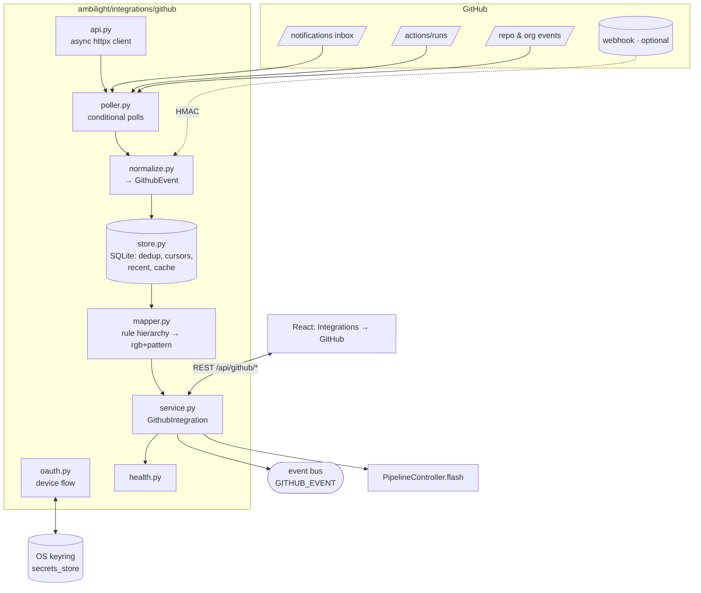
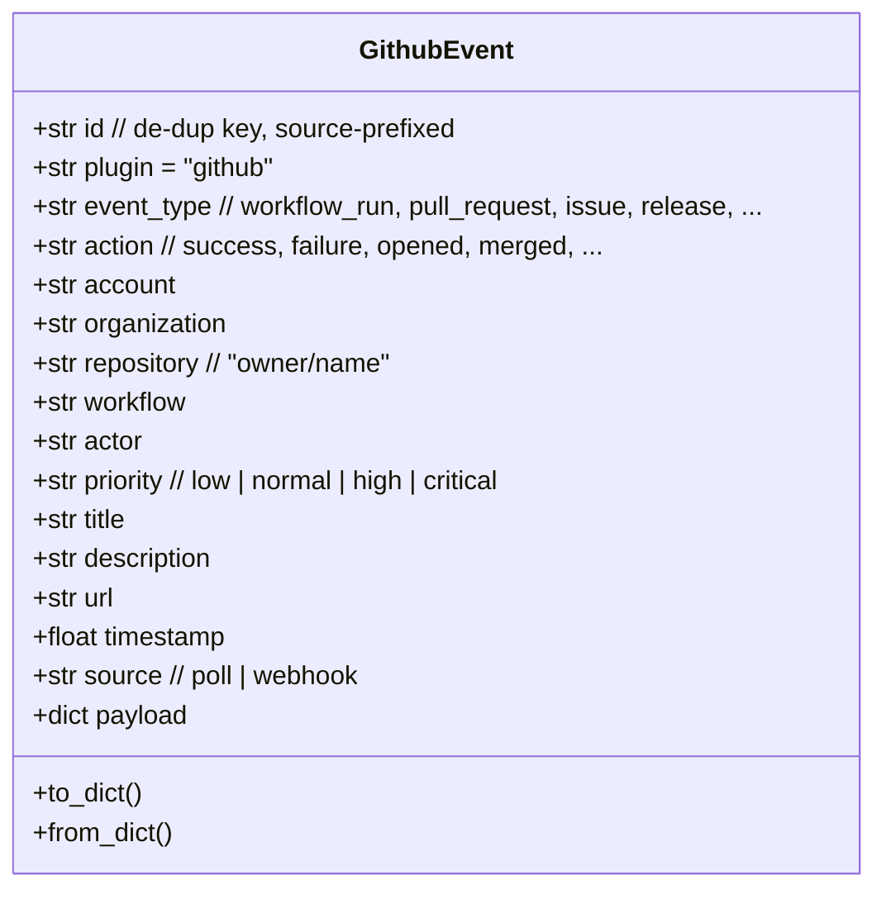
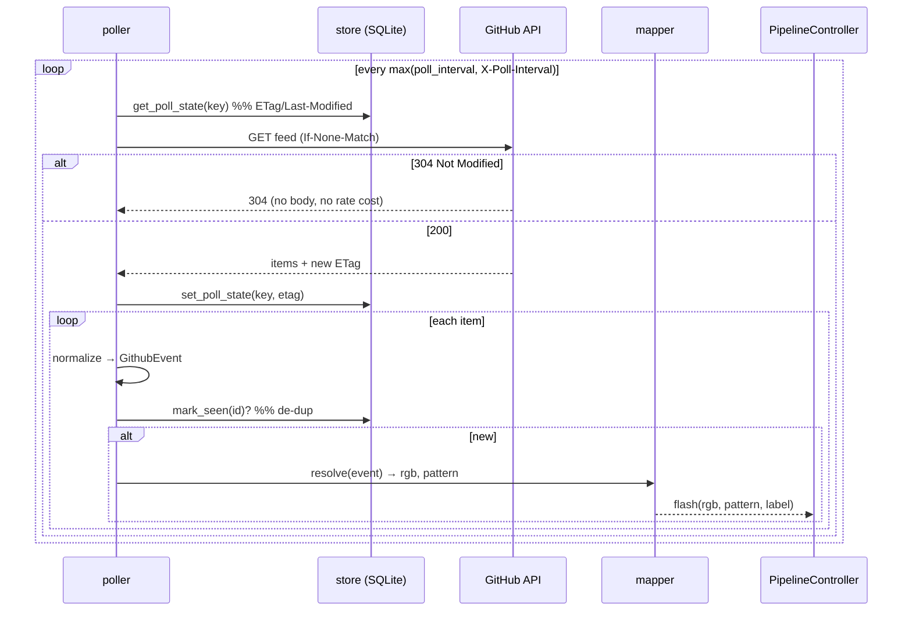

# GitHub Integration — Technical Design

**"Ambient GitHub Awareness System"** — turn GitHub activity into customizable ambient lighting.

This document is the enterprise design for the GitHub integration shipped in
`ambilight/integrations/github/`. It is written so the integration can later be
generalised to Gmail, Discord, Slack, Teams, Jira, etc. — the plugin owns all
GitHub-specific logic and the rest of the app only ever sees a normalized event
and a flash request.

---

## 1. Goals & constraints

| Goal | Decision |
|---|---|
| React to **any** GitHub activity | Event-type-agnostic normalizer; unknown types degrade to a generic event |
| Work on a **desktop behind NAT** | **Polling-first** (no public endpoint); webhooks are an optional advanced mode |
| Simple, secure sign-in | **OAuth Device Flow** — public `client_id`, no secret shipped, token in OS keyring |
| User owns the look | **All colours user-configured** in the Integrations → GitHub tab; **no brand-colour lookup** |
| Never destabilise the core app | Off by default; a **no-op without the optional `httpx` dependency** |
| Never drive LEDs directly | Plugin emits a normalized event and requests a flash via `PipelineController.flash` |

---

## 2. Architecture



The integration sits on the same substrate as the MQTT bridge and the
Notification Flash service: the **event bus** (`ambilight/events.py`), the typed
**config** (`ambilight/config.py`), the **keyring secret store**
(`ambilight/integrations/secrets_store.py`), and `PipelineController.flash`.

---

## 3. Folder structure

```
ambilight/integrations/github/
  __init__.py     exports GithubIntegration; no-op if httpx absent
  service.py      GithubIntegration — lifecycle, auth, dispatch, read-APIs
  oauth.py        OAuth Device Flow (request_device_code, poll_for_token)
  api.py          async REST client (conditional requests, rate-limit aware)
  poller.py       poll loop across inbox + workflow runs + events feeds
  webhook.py      HMAC-SHA256 verification + header parsing (optional path)
  normalize.py    raw payloads → GithubEvent (the only GitHub-format-aware module)
  mapper.py       rule hierarchy (workflow→repo→org→global) → (rgb, pattern)
  models.py       GithubEvent dataclass + priority constants
  store.py        SQLite: seen/dedup, recent ring buffer, poll cursors, cache
  health.py       status snapshot (auth, rate limit, last poll, errors)
```

`GithubConfig` lives in `ambilight/config.py` alongside the other typed config
sections (validated/clamped in `ConfigManager._normalize_and_validate`).

---

## 4. Normalized event model



**Normalization table** (source → `event_type` / `action`):

| Source | Input | event_type | action |
|---|---|---|---|
| Inbox | `subject.type=PullRequest`, `reason=review_requested` | `pull_request` | `review_requested` |
| Inbox | `subject.type=CheckSuite` | `workflow_run` | (from reason) |
| Inbox | `reason=security_alert` | `security_alert` | `security_alert` (priority **critical**) |
| Actions | `status=completed`, `conclusion=failure` | `workflow_run` | `failure` (priority **high**) |
| Actions | `status=in_progress` | `workflow_run` | `in_progress` |
| Events | `PullRequestEvent` + `merged=true` | `pull_request` | `merged` |
| Events | `ReleaseEvent` | `release` | `published` |
| Events | `WatchEvent` | `star` | `started` |
| Webhook | `X-GitHub-Event: workflow_run` | `workflow_run` | conclusion |
| Webhook | `dependabot_alert` / `code_scanning_alert` | `security_alert` | (payload action) |
| *any unknown* | — | `notification`/`activity` | best-effort (never dropped) |

Adding an event type is a single mapping entry in `normalize.py`.

---

## 5. Colour rule hierarchy (user-configured)

`mapper.resolve(event, rules, default_color, default_pattern)` selects the
**most specific** matching rule:

```
Workflow  >  Repository  >  Organization  >  Global default
```

A rule (plain dict, stored in `GithubConfig.rules`):

```jsonc
{
  "scope": "workflow|repo|org|global",
  "repo": "owner/name",      // repo/workflow scope
  "org": "orgname",          // org scope
  "workflow": "Deploy",      // workflow scope
  "event_type": "workflow_run",  // "" / "*" = any
  "action": "failure",           // "" / "*" = any
  "color": [220, 40, 40],
  "blink_count": 4, "on_ms": 120, "off_ms": 80, "brightness": 1.0  // optional
}
```

Scoring: `scope_weight*10 + (event_type specified ? 2) + (action specified ? 1)`;
highest wins, ties break to the earlier rule. Unmatched events use the global
**default colour** — or are ignored entirely if the user clears it.
**There is no brand-colour table** — every colour is chosen by the user.

---

## 6. Event delivery

### 6.1 Polling (default)



Sources combined: **notifications inbox** (`/notifications`), **workflow runs**
per watched repo (`/repos/{repo}/actions/runs`), and the **events feed** for
watched repos/orgs. The first poll primes the de-dup cursor without flashing the
backlog. Conditional requests + `X-Poll-Interval` keep it well under the
5000 req/hr authenticated rate limit.

### 6.2 OAuth Device Flow

```mermaid
sequenceDiagram
    participant UI
    participant SVC as GithubIntegration
    participant GH as github.com
    UI->>SVC: POST /api/github/auth/start
    SVC->>GH: POST /login/device/code (client_id)
    GH-->>SVC: device_code, user_code, verification_uri, interval
    SVC-->>UI: user_code + verification_uri
    UI->>GH: user opens verification_uri, enters user_code
    loop every interval (background task)
      SVC->>GH: POST /login/oauth/access_token (device_code)
      alt authorization_pending
        GH-->>SVC: error=authorization_pending
      else success
        GH-->>SVC: access_token
        SVC->>SVC: keyring.set_github_token(); connect(); poll
      end
    end
    UI->>SVC: GET /api/github/status (polls) → connected
```

### 6.3 Webhooks (optional / advanced)

`POST /api/github/webhook` (unauthenticated) verifies `X-Hub-Signature-256`
(HMAC-SHA256 over the raw body, secret from the keyring), then feeds
`normalize_webhook` → the same dispatch path. Gated by `github.webhook_enabled`;
returns 404 when disabled. Suited to power users running a tunnel
(cloudflared/ngrok) or a future cloud relay.

---

## 7. Persistence

**Tokens** → OS keyring via `secrets_store` (`github_token`,
`github_refresh_token`, `github_webhook_secret`); **never** in YAML or SQLite.

**SQLite** at `~/.ambilight/github.db`:

```sql
CREATE TABLE seen       (id TEXT PRIMARY KEY, ts REAL);                 -- de-dup
CREATE TABLE events     (id TEXT PRIMARY KEY, ts REAL, json TEXT);      -- recent ring buffer (cap 200)
CREATE TABLE poll_state (key TEXT PRIMARY KEY, etag TEXT,               -- conditional-request cursors
                         last_modified TEXT, last_poll REAL);
CREATE TABLE cache      (key TEXT PRIMARY KEY, json TEXT, ts REAL);     -- account/orgs/repos
```

**Config** (`GithubConfig`, persisted in `configuration.yaml`): `enabled`,
`client_id`, `scopes`, `poll_interval_s`, `watch_notifications`,
`watched_repos`, `watched_orgs`, `default_color`, `brightness`, `blink_count`,
`on_ms`, `off_ms`, `rules`, `webhook_enabled`.

---

## 8. REST API

All under `/api/github`, token-guarded (`Depends(verify_token)`) except the
webhook receiver.

| Method | Path | Purpose |
|---|---|---|
| GET | `/api/github/status` | auth state, account, rate limit, last poll, errors, `client_id_configured` |
| POST | `/api/github/auth/start` | begin device flow → `{user_code, verification_uri, expires_in, interval}` |
| POST | `/api/github/auth/logout` | clear token + stop polling |
| GET | `/api/github/orgs` | the user's organisations |
| GET | `/api/github/repos` | the user's repositories |
| GET | `/api/github/events?limit=` | recent normalized events (UI feed) |
| POST | `/api/github/test` | preview flash with `{color}` |
| POST | `/api/github/webhook` | optional HMAC-verified receiver (unauthenticated) |

Rules/colours/watch-lists persist through the existing `GET/PUT /api/config`.

---

## 9. Plugin interface & lifecycle

`GithubIntegration` mirrors `NotificationFlashService`: constructed at
`startup_event`, refreshed on `CONFIG_UPDATE`, stopped at shutdown.

```python
class GithubIntegration:
    def __init__(self, cfg, controller, loop=None): ...
    def start(self) -> None: ...                 # connect+poll if enabled & token present
    def update_config(self, cfg) -> None: ...    # reconfigure / start / stop
    def stop(self) -> None: ...                   # cancel tasks, close store
    async def begin_auth(self) -> dict: ...       # device flow prompt
    async def logout(self) -> None: ...
    def status(self) -> dict: ...
    async def list_orgs(self) / list_repos(self): ...
    def recent_events(self, limit) -> list: ...
    def test_flash(self, color=None) -> None: ...
    async def ingest_webhook(self, event_name, payload, delivery_id=""): ...
```

The running state is reconciled by `_apply_running_state()` against
`enabled ∧ token ∧ httpx_available`, so toggling the feature, signing in, or
signing out all converge to the right poller state.

---

## 10. Error, retry & health strategy

- **Conditional requests** (`ETag`/`If-Modified-Since`) → 304s cost no rate limit.
- **Backoff**: transient/`5xx` errors grow the interval ×1.5 up to 300 s; `401/403`
  back off ≥120 s. Success resets backoff.
- **De-dup**: `store.mark_seen(id)` guarantees each event flashes once even across
  overlapping sources and re-polls.
- **Graceful degradation**: missing `httpx` → integration disabled, app unaffected;
  missing `keyring` → session-only token (warned).
- **Health** (`/api/github/status`): `auth_state`, `account`, `rate_remaining/limit`,
  `last_poll_ts`, `poll_interval_s`, `last_error`, `error_count`.

---

## 11. Security

- OAuth **device flow** — no client secret in the app; least-privilege scopes
  (`notifications`, `read:org`, `repo`), configurable.
- Tokens and the webhook secret in the **OS keyring**, scrubbed from any YAML save.
- Webhook **HMAC-SHA256** verification, fail-closed (`hmac.compare_digest`).
- `openExternal` IPC allowlist extended only to `https://github.com/login/device`.

---

## 12. Implementation roadmap

| Phase | Scope | Status |
|---|---|---|
| 0 | This design document | ✅ |
| 1 | Backend: config, secrets, github package, startup wiring, unit tests | ✅ |
| 2 | REST API + device-flow auth + webhook receiver | ✅ |
| 3 | UI: Integrations tab + GitHub page (connect, watch, **user colour rules**, recent events) | ✅ |
| 4 | Advanced: enable webhook mode in UI; broaden normalization; pulse/rainbow effects via `effects_engine`; per-job rules | ⏳ |

**Activation:** works out of the box — `httpx` and `keyring` are installed by
default and the app ships a built-in OAuth client id
(`service.BUILTIN_CLIENT_ID`). Override it with your own OAuth App via
`github.client_id`, the `AMBILIGHT_GITHUB_CLIENT_ID` env var, a `.env` file, or a
build-baked `github_client_id.txt` (CI injects `GH_OAUTH_CLIENT_ID`). The user
just clicks **Connect** and signs in.
